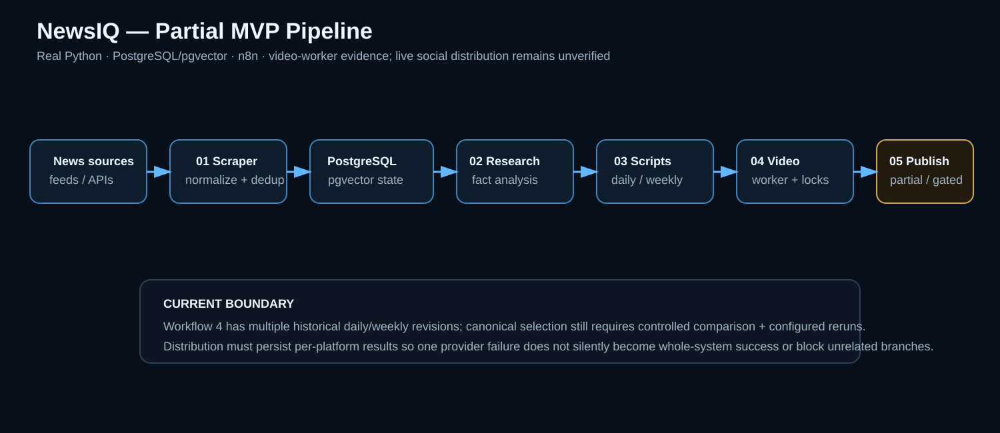
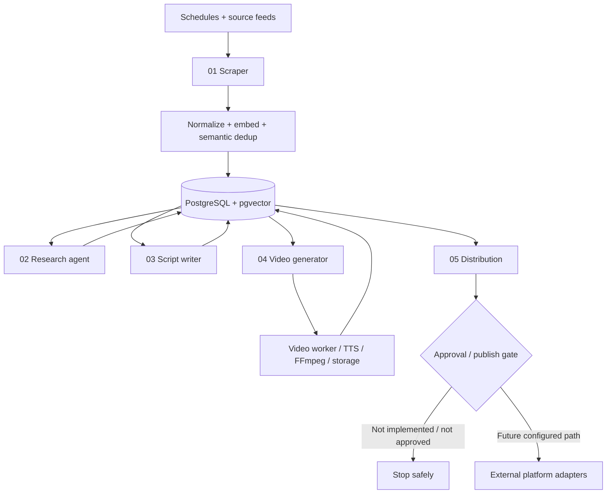

# NewsIQ

> **Evidence status: Partial MVP — not a live production system**

NewsIQ is an AI-assisted news-intelligence pipeline built from five n8n workflow exports, Python services, a PostgreSQL/pgvector schema, and Docker/Railway-oriented deployment files. The repository shows real implementation work while keeping unverified runtime and publishing claims outside the evidence boundary.

[Open the visual project page](./index.html)

<p align="center"></p>

## What exists

| Component | Evidence | Status |
|---|---|---|
| Scraper + semantic deduplication | `n8n_workflows/01_scraper.json` | Export present; runtime not re-verified |
| Research / fact analysis | `n8n_workflows/02_research_agent.json` | Export present; providers require configuration |
| Daily / weekly scripts | `n8n_workflows/03_script_writer.json` | Export present; credentials removed |
| Audio/video orchestration | `n8n_workflows/04_video_generator.json` + `video-worker/` | Implementation evidence present |
| Distribution orchestration | `n8n_workflows/05_distribution.json` | Export present; live social publishing intentionally disabled/unverified |
| Data layer | `database/schema.sql` | Nine-table PostgreSQL schema with pgvector |
| API / utility code | `python_nodes/` | FastAPI, embeddings, video/Drive helpers, short-form extraction |
| Deployment files | `Dockerfile`, `railway.toml`, `start.sh` | Configuration present; no current live-deployment claim |

## Architecture



See [architecture](docs/architecture.md), [current visual sources](docs/current-visuals.md), and [verification gate](docs/verification.md).

## Workflow inventory

The five public exports contain **92 nodes**:

| Workflow | Nodes | Responsibility |
|---|---:|---|
| `01_scraper.json` | 12 | Scheduled ingestion, normalization, embeddings, semantic deduplication, persistence |
| `02_research_agent.json` | 12 | Pending-headline selection, web search, AI-assisted analysis, research persistence |
| `03_script_writer.json` | 19 | Daily/weekly selection, ranking, script generation, validation, persistence |
| `04_video_generator.json` | 18 | Script selection, TTS, video composition, storage/approval orchestration |
| `05_distribution.json` | 31 | Approval gate, distribution orchestration, short-form segmentation, records, notifications |

## Public-package safety corrections

- Social publishing does not fabricate successful external post IDs.
- Weekly approval defaults are bounded rather than silently authorizing publishing.
- Credential identifiers and environment-specific public configuration use placeholders.
- No claim is made that the complete intended system is live, production-ready, or publishing to real social accounts.

## Version boundary

Historical archive evidence contains multiple revisions of Workflow 4 daily and weekly variants. The current public `04_video_generator.json` is a package representation, not proof that the newest archived revision has been selected as canonical.

Canonical W4/W5 selection requires controlled comparison plus configured execution against the current database/video-worker/distribution contract.

## Local setup

Prerequisites: Python 3.11+, PostgreSQL with `vector`, FFmpeg, n8n, and optionally Docker.

```bash
cp config/.env.example .env
psql "$DATABASE_URL" -f database/schema.sql
python -m venv .venv
source .venv/bin/activate
pip install -r requirements.txt
uvicorn python_nodes.api_service:app --host 0.0.0.0 --port 8001
```

Import the workflow JSON files in numeric order, reconnect every credential reference, review environment variables, and test each stage in isolation before activation.

## Verification status

The package has evidence for JSON parseability, Python source, placeholder configuration, database schema, workflow structure, video-worker code, and explicit disabling/bounding of unimplemented publishing.

It has **not** been presented as passing a complete configured end-to-end live run.

See [`docs/verification.md`](docs/verification.md) for the actual required matrix, including duplicate handling, provider failures, W4 selection, video locks/retries, approval behavior, and branch-isolated distribution.

## Known limitations

- Social publishing adapters are not verified as live.
- Weekly approval integration is incomplete/unverified.
- External APIs, OAuth, database connectivity, storage, and notifications require configuration.
- Existing stress/debug scripts are implementation evidence, not proof that the current public package passed those loads.
- No paying customers, production traffic, reliability SLA, or business outcome is claimed.
- A configured live demo video is not included yet.

## Security

Read [SECURITY.md](./SECURITY.md). Historical credential-bearing debugging/setup material is deliberately outside the public package; any historically exposed provider key should be treated as compromised and rotated if it could still be active.

## Author

**Oyekola Ololade**  
AI Systems & Integration Engineer

- [GitHub](https://github.com/oyekola-ololade)
- [LinkedIn](https://www.linkedin.com/in/ololade-oyekola-5b1797397/)
- [Email](mailto:oyekolaololade69@gmail.com)
