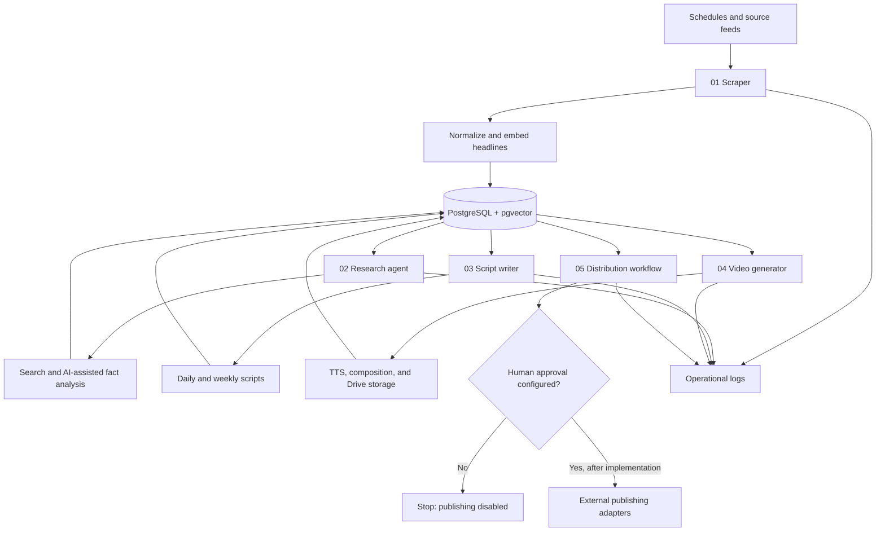

# NewsIQ

> **Evidence status: Partial MVP — not a live production system**

NewsIQ is an AI-assisted news-intelligence pipeline built from five n8n workflow exports, Python services, a PostgreSQL/pgvector schema, and Docker/Railway deployment files. The repository shows real implementation work, while keeping unverified runtime and publishing claims outside the evidence boundary.

[Open the visual project page](./index.html)

## What exists

| Component | Evidence in this repository | Status |
|---|---|---|
| Scraper and semantic deduplication | `n8n_workflows/01_scraper.json` | Export present; runtime not re-verified |
| Research and fact-analysis workflow | `n8n_workflows/02_research_agent.json` | Export present; external services require configuration |
| Daily and weekly script generation | `n8n_workflows/03_script_writer.json` | Export present; model credentials removed |
| Audio/video orchestration | `n8n_workflows/04_video_generator.json` | Export and Python/video-worker code present |
| Distribution orchestration | `n8n_workflows/05_distribution.json` | Export present; social publishing is intentionally disabled |
| Data layer | `database/schema.sql` | Nine-table PostgreSQL schema with pgvector |
| API and utility code | `python_nodes/` | FastAPI, embeddings, video/Drive helpers, and short-form extraction |
| Video worker | `video-worker/` | FFmpeg/gTTS/S3-compatible worker and test scripts |
| Deployment files | `Dockerfile`, `railway.toml`, `start.sh` | Configuration present; no current live-deployment claim |

## Architecture

The five workflow exports implement the main stages below. This diagram describes the repository evidence, not a claim that every stage is currently running in production.



See [docs/architecture.md](./docs/architecture.md) for component boundaries and [docs/workflow-inventory.md](./docs/workflow-inventory.md) for the inspected workflow evidence.

## Workflow inventory

The exports contain **92 nodes in total**:

| Workflow | Nodes | Primary responsibility |
|---|---:|---|
| `01_scraper.json` | 12 | Scheduled ingestion, normalization, embeddings, semantic deduplication, persistence |
| `02_research_agent.json` | 12 | Pending-headline selection, web search, AI-assisted analysis, research persistence |
| `03_script_writer.json` | 19 | Daily/weekly selection, ranking, script generation, validation, persistence |
| `04_video_generator.json` | 18 | Script selection, TTS, video composition, Drive upload, approval notification |
| `05_distribution.json` | 31 | Approval gate, distribution orchestration, short-form segmentation, records, notifications |

## Important safety corrections in this public package

- YouTube, TikTok, and Instagram endpoints now return **HTTP 501** instead of fabricated success IDs.
- The weekly approval-check node defaults to `approved: false`; it cannot silently authorize publishing.
- n8n credential IDs and instance identifiers have been replaced with `REPLACE_IN_N8N`.
- The public environment file contains placeholders only.
- No claim is made that the complete intended ten-stage system is live, production-ready, or publishing to real social accounts.

## Repository structure

```text
.
├── config/
│   └── .env.example
├── database/
│   └── schema.sql
├── docs/
│   ├── architecture.md
│   ├── evidence-status.md
│   └── workflow-inventory.md
├── n8n_workflows/
│   ├── 01_scraper.json
│   ├── 02_research_agent.json
│   ├── 03_script_writer.json
│   ├── 04_video_generator.json
│   └── 05_distribution.json
├── python_nodes/
│   ├── api_service.py
│   ├── shared_utils.py
│   └── shortform_extractor.py
├── video-worker/
│   ├── main.py
│   ├── Dockerfile
│   ├── requirements.txt
│   └── tests/
├── Dockerfile
├── railway.toml
├── requirements.txt
└── start.sh
```

## Local setup

### 1. Prerequisites

- Python 3.11+
- PostgreSQL with the `vector` extension
- FFmpeg
- n8n
- Docker, optionally

### 2. Configure

```bash
cp config/.env.example .env
```

Replace placeholders locally. Do not commit `.env`, OAuth files, service-account JSON, API keys, database credentials, or personal data.

### 3. Initialize the database

```bash
psql "$DATABASE_URL" -f database/schema.sql
```

### 4. Run the Python API

```bash
python -m venv .venv
source .venv/bin/activate
pip install -r requirements.txt
uvicorn python_nodes.api_service:app --host 0.0.0.0 --port 8001
```

### 5. Import the workflows

Import each JSON file into n8n in numeric order. Reconnect every credential reference, review all environment variables, and test each workflow in an isolated environment before activation.

## Validation status

This repository package has been checked for:

- JSON parseability of all five n8n exports
- Python syntax compilation
- placeholder-only public configuration
- removal of n8n credential identifiers
- explicit disabling of unimplemented social publishing
- explicit project status and limitations

It has **not** been presented as passing a complete configured end-to-end live run.

## Known limitations

- Social publishing adapters are not implemented or verified.
- The weekly approval integration is not implemented.
- External APIs, OAuth flows, database connectivity, storage, and notification channels require configuration.
- Existing stress-test scripts are implementation evidence, not proof that the current public package passed those loads.
- No paying customers, production traffic, reliability SLA, or business outcome is claimed.
- A configured live demo video is not included yet.

## Security

Read [SECURITY.md](./SECURITY.md) before configuration. Historical credential-bearing setup material was deliberately excluded from this package.

## Author

**Oyekola Ololade**  
AI Systems & Integration Engineer

- [GitHub](https://github.com/oyekola-ololade)
- [LinkedIn](https://www.linkedin.com/in/ololade-oyekola-5b1797397/)
- [Email](mailto:oyekolaololade69@gmail.com)

