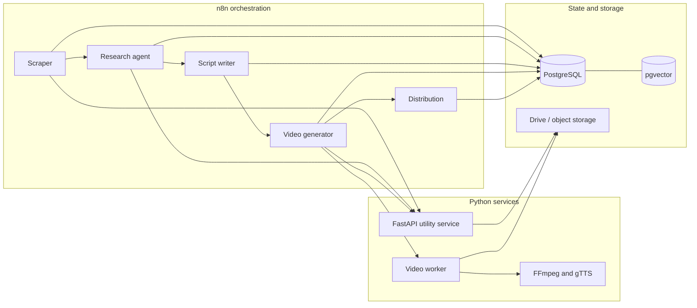

# NewsIQ Architecture

## Status boundary

This document describes the architecture represented by the source and workflow exports in this repository. It does not certify a live deployment or a complete production system.

## Component map

## Data flow

1. The scraper collects source items, normalizes fields, generates embeddings, and performs semantic deduplication.
2. The research workflow selects pending headlines, gathers search context, requests AI-assisted analysis, and persists research.
3. The script workflow creates daily and weekly variants, validates structure, and persists scripts.
4. The video workflow prepares TTS text, calls composition services, stores media, and requests approval.
5. The distribution workflow is designed to gate publishing and record distribution outcomes.

## State model

The included schema defines nine primary tables:

- `categories`
- `sources`
- `headlines`
- `research`
- `scripts`
- `videos`
- `distributions`
- `notifications`
- `logs`

The `vector` extension supports embedding-based similarity work. Schema presence is evidence of design and implementation—not proof of a currently operating database.

## Trust boundaries

- Source feeds and search providers are external and untrusted.
- Model output must be parsed and validated before persistence.
- OAuth and social-platform integrations require separate authorization.
- Publication must remain behind a real approval mechanism.
- Database, storage, and API credentials belong in environment variables or platform credential stores.

