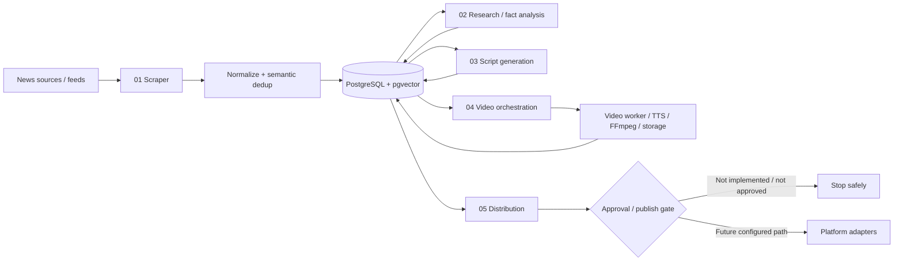
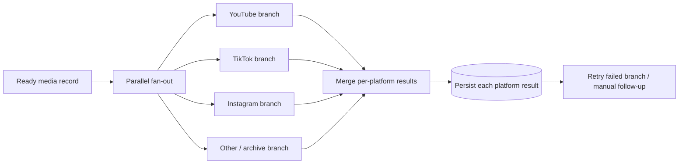
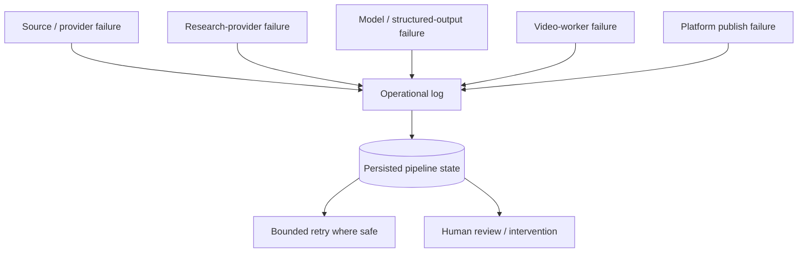

# NewsIQ Current Visual Sources

These diagrams describe the current repository evidence and intended later distribution behavior. They do not upgrade the project beyond **Partial MVP**.

## End-to-end pipeline

## Parallel distribution fault-isolation target

**Design objective:** one platform failure should not automatically block all other platform attempts. The public package still requires configured branch-level tests before this can be treated as verified runtime behavior.

## Failure map

## Version boundary

Workflow 4 has multiple daily and weekly revisions in the historical archive. The GitHub `04_video_generator.json` file is a public package representation, not proof that the newest archived revision has been selected as canonical. Canonical selection requires a controlled comparison plus configured verification.
