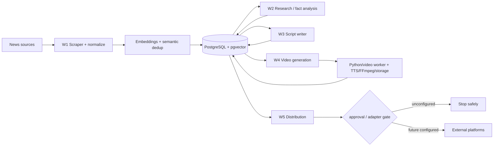

# NewsIQ — Current Partial-MVP Architecture

[← Version Table of Contents](../TABLE_OF_CONTENTS.md)

**Status:** explanatory architecture for the current partial MVP, not proof of a live end-to-end publishing system.