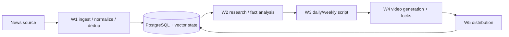

# NewsIQ — Current Partial-MVP System Record

**Status:** PARTIAL MVP / IMPLEMENTATION PROJECT  
**Current architecture:** Python services + PostgreSQL/pgvector + five n8n workflow stages + separate video-worker  
**Not established:** fully configured autonomous multi-platform production publishing.

## Current pipeline

| Stage | Responsibility | Current evidence |
|---|---|---|
| W1 Scraper | fetch, normalize, deduplicate, persist headlines | workflow + Python/database implementation evidence |
| W2 Research Agent | enrich/fact-check/score | implementation/provider-history mixed; provider must be confirmed |
| W3 Script Writer | generate daily/weekly scripts | implementation artifact |
| W4 Video Generation | produce media through worker/lock flow | multiple genuine daily/weekly revisions; canonical selection pending |
| W5 Distribution | publish/distribute output | partial/multiple variants; branch verification pending |

## Application/data layer

The repository also contains:

- Python API/service code;
- PostgreSQL schema with pgvector-related data design;
- environment/config templates;
- Docker/Railway packaging;
- separate video-worker history/evidence in the Drive archive;
- debugging/deployment screenshots and workflow screenshots in the project archive.

## End-to-end state model

## Current evidence locations

- `../../assets/current-pipeline.svg`
- `../../docs/current-visuals.md`
- `../../docs/verification.md`
- `../../evidence/current/demo/README.md` — demo placeholder until a genuine current configured run is recorded;
- `../../evidence/current/screenshots/README.md` — current screenshot register/placeholder rules.

## Current verification gates

1. rerun W1 source + DB behavior;
2. confirm W2 provider/fallback against current code/config;
3. representative daily/weekly W3 generation;
4. choose W4 Daily/Weekly candidates through topology + configured worker execution;
5. test W5 platform branches independently;
6. preserve per-stage and end-to-end failure evidence;
7. confirm no exposed/legacy credentials remain active.

## Evidence boundary

This current record supports a real partial implementation with code, database schema, workflow exports, deployment/debug history and video-worker work. It does not support a claim of a complete live autonomous publishing system.