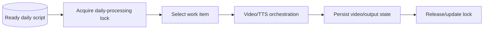

# NewsIQ W4 Daily v1 — Architecture

[← Revision Table of Contents](../../TABLE_OF_CONTENTS.md)

**Revision status:** historical first daily W4 revision. This diagram captures the supported responsibility boundary; v1 is not automatically canonical.