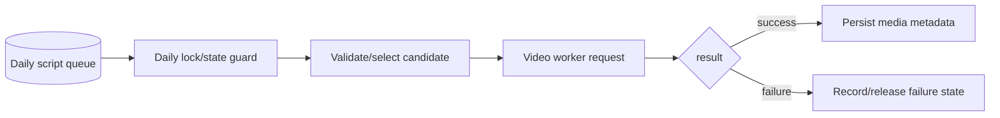

# NewsIQ W4 Daily v2 — Architecture

[← Revision Table of Contents](../../TABLE_OF_CONTENTS.md)

**Revision status:** historical chronological revision; exact canonical promotion requires execution-aware comparison.