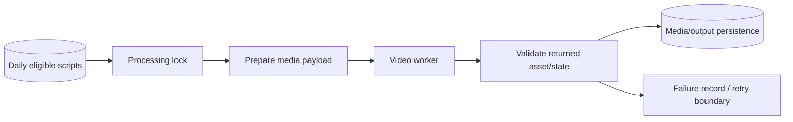

# NewsIQ W4 Daily v3 — Architecture

[← Revision Table of Contents](../../TABLE_OF_CONTENTS.md)

```mermaid
flowchart LR
  Queue[(Daily eligible scripts)] --> Lock[Processing lock]
  Lock --> Prepare[Prepare media payload]
  Prepare --> Worker[Video worker]
  Worker --> Verify[Validate returned asset/state]
  Verify --> Persist[(Media/output persistence)]
  Verify --> Failure[Failure record / retry boundary]
```

**Revision status:** historical. Diagram is explanatory, not a runtime screenshot.