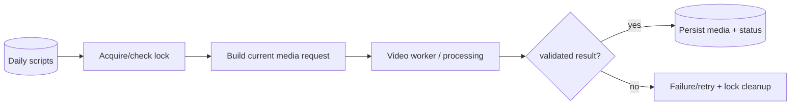

# NewsIQ W4 Daily v4 — Architecture

[← Revision Table of Contents](../../TABLE_OF_CONTENTS.md)

**Revision status:** latest chronological daily revision in the recovered sequence, **not automatically canonical**.