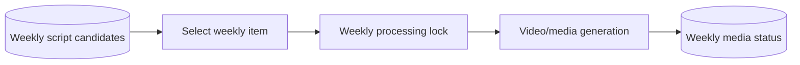

# NewsIQ W4 Weekly v1 — Architecture

[← Revision Table of Contents](../../TABLE_OF_CONTENTS.md)

```mermaid
flowchart LR
  DB[(Weekly script candidates)] --> Select[Select weekly item]
  Select --> Lock[Weekly processing lock]
  Lock --> Worker[Video/media generation]
  Worker --> Persist[(Weekly media status)]
```

Historical weekly revision; architecture is explanatory evidence only.