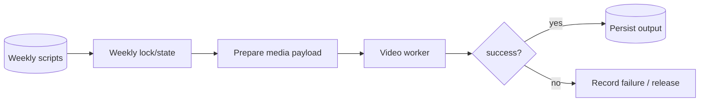

# NewsIQ W4 Weekly v2 — Architecture

[← Revision Table of Contents](../../TABLE_OF_CONTENTS.md)

```mermaid
flowchart LR
  DB[(Weekly scripts)] --> Lock[Weekly lock/state]
  Lock --> Prepare[Prepare media payload]
  Prepare --> Worker[Video worker]
  Worker --> Verify{success?}
  Verify -->|yes| Persist[(Persist output)]
  Verify -->|no| Fail[Record failure / release]
```

Historical chronological revision; canonical status remains unverified.