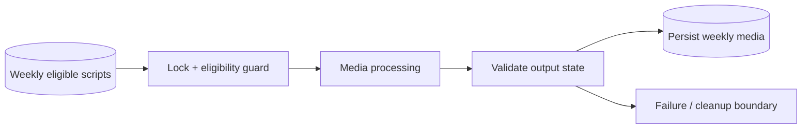

# NewsIQ W4 Weekly v3 — Architecture

[← Revision Table of Contents](../../TABLE_OF_CONTENTS.md)

Latest chronological weekly revision in the recovered sequence; **latest does not equal canonical**.