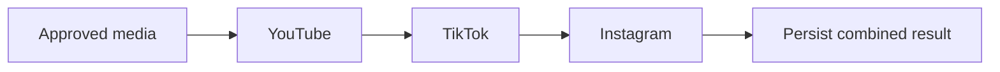
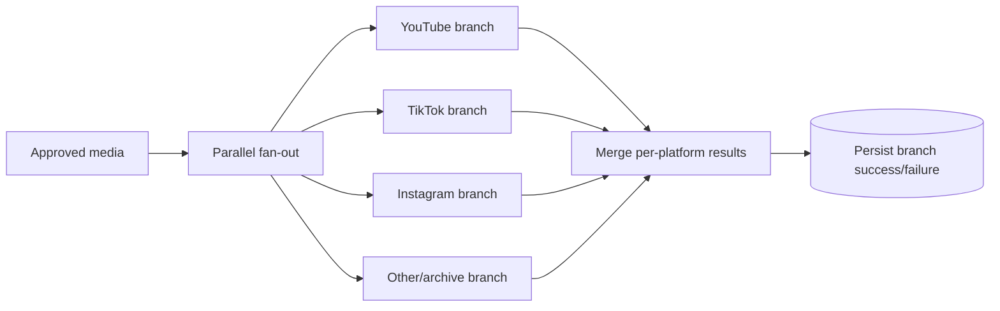

# NewsIQ W5 — Distribution Evolution Architecture

[← Revision Table of Contents](../TABLE_OF_CONTENTS.md)

## Earlier sequential pattern

A failure early in a sequential chain can prevent later attempts.

## Later fault-isolated direction

**Status:** architecture evolution supported by the project history; live multi-platform publishing is still not established.