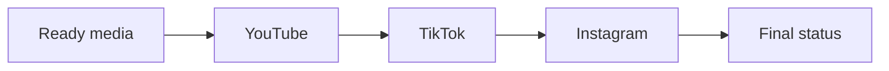
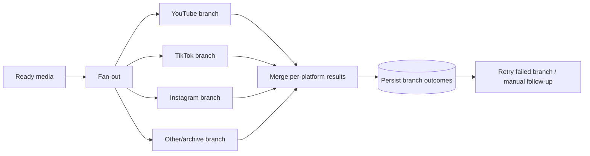

# NewsIQ W5 — Distribution Architecture & Evolution

**Status:** PARTIAL IMPLEMENTATION / MULTIPLE VARIANTS  
**Canonical status:** NOT YET SELECTED

## Responsibility

W5 receives media/output records from W4 and attempts platform distribution. It should persist **per-platform outcomes** so one failed destination does not erase successful attempts elsewhere or falsely mark the entire distribution job successful.

## Important architectural evolution

The key known change is from a **sequential posting model** toward **parallel independent platform branches with merged results**.

### Earlier sequential model

Risk: failure in an early platform can prevent later attempts or make global success/failure semantics ambiguous.

### Later intended parallel model

## Canonical-selection requirements

A current W5 candidate must demonstrate in topology and execution that:

- platform branches are independently attempted where intended;
- failure in one branch does not silently cancel unrelated branches;
- each branch produces an explicit success/failure result;
- merged state does not report global success when a required branch failed;
- retries do not duplicate already-successful publishing side effects;
- platform API/version requirements are current;
- credential/config placeholders are safe for public release.

## Evidence boundary

The archive proves W5 evolution and partial implementation work. It does **not** establish fully configured autonomous multi-platform publishing. No separate historical demo/screenshot placeholders are created; current project evidence belongs under `evidence/current/`.