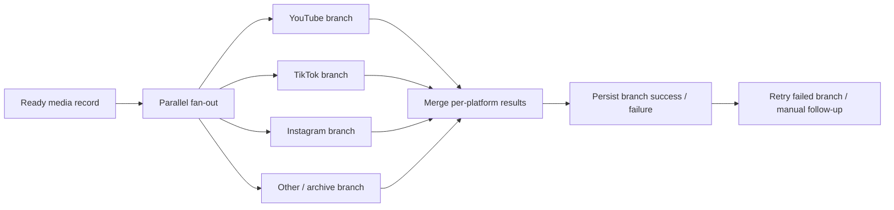

# NewsIQ W5 — Distribution Evolution

[← Main README](../../README.md) · [Architecture diagram](ARCHITECTURE.md)

**Status:** PARTIAL / MULTIPLE VARIANTS · current canonical distribution workflow not yet proven

## Contents

- [Supported architectural evolution](#supported-architectural-evolution)
- [Architecture](#architecture)
- [Current evidence boundary](#current-evidence-boundary)
- [Canonical promotion gate](#canonical-promotion-gate)

## Supported architectural evolution

The important change in the surviving NewsIQ distribution history is from **sequential platform posting** toward **parallel independent platform branches with merged results**.

The reason is operational: failure on one platform should not prevent attempts to publish to other configured destinations.

## Architecture

[Open the W5 distribution architecture →](ARCHITECTURE.md)

## Current evidence boundary

The architecture direction is supported. Full configured multi-platform success is **not** currently established.

## Canonical promotion gate

A W5 variant should only be promoted when:

- each configured platform branch is structurally valid;
- one branch failure does not suppress the others;
- per-platform results are persisted independently;
- retries do not duplicate already-successful posts;
- API/auth assumptions are current;
- configured test runs exist for success and failure cases.

Historical/evolution record: demo/screenshot placeholders live only at the current project-state level.
